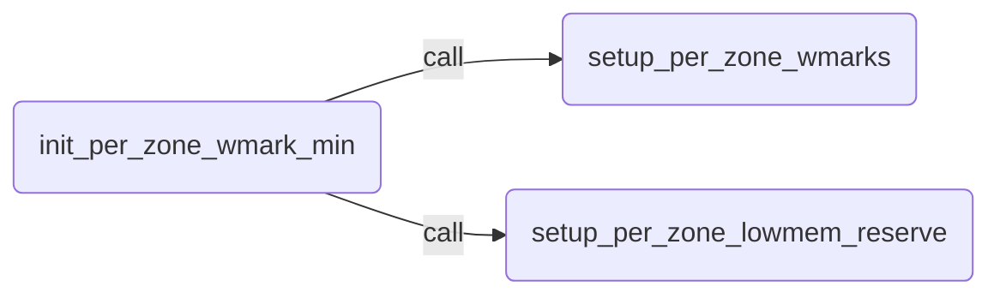
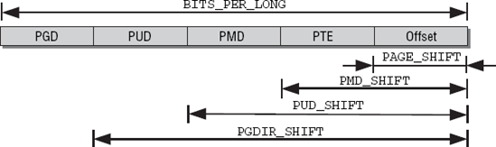
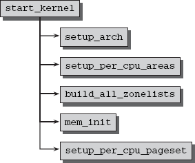
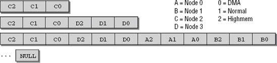
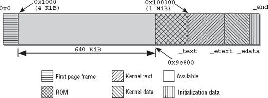
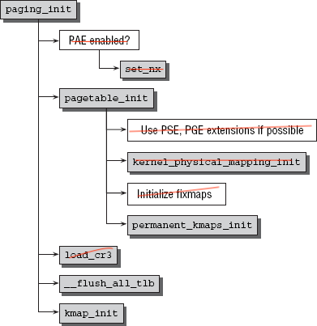
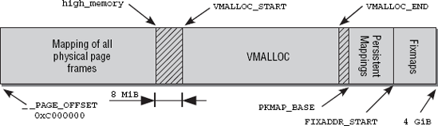
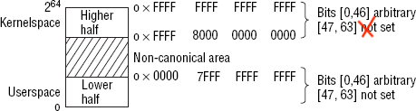

[TOC]


# Memory Management

## Organization

- virtual address

- PAGE_SHIFT: At the end of each pointer there are several bits to specify the position within the selected frame page. The number of bits required is held in `PAGE_SHIFT`

- high memory

- low memory

- user space

- kernel space

- 

### Node

```c
<linux/mmzone.h>
typedef struct pglist_data {
        struct zone node_zones[MAX_NR_ZONES];
        struct zonelist node_zonelists[MAX_ZONELISTS]; /*specifies alternative nodes and 														  their zones in the order in 														     which they are used for memory 														 allocation if no more space is 														 available in the current zone.*/
        int nr_zones;
        struct page *node_mem_map; /* point to an array of page instances used to describe 										 all physical pages of the node.*/
        struct bootmem_data *bdata; // point to bootmem allocator

        unsigned long node_start_pfn; /* each frame is given a number that is globally 										   unique (not just unique to the node).*/
        unsigned long node_present_pages; /* total number of physical pages */
        unsigned long node_spanned_pages; /* total size of physical page
                                              range, including holes */
        int node_id;
        wait_queue_head_t kswapd_wait; /* wait queue for the swap daemon needed when 											  swapping frames out of the zone */
        struct task_struct *kswapd;
        int kswapd_max_order;
} pg_data_t;
```

###Zone

- `ZONE_DMA` for DMA-suitable memeory. The size depends on the processor type. ON IA-32 machines, the limit is the classical 16 MiB boundary.
- `ZONE_DMA32` for DMA-suitable memory in a 32-bit addreeeable area. On 32-bit machines, this zone is empty; that is, its size is 0 MiB. On Alphas and AMD64 systems, for instance, this zone ranges from 0 to 4 GiB.
- `ZONE_HIGHMEM` for physical memory that extends beyond the kernel segment

Depending on the compile-time configuration, some zones need not be considered. 64-bit systems, for instance, do not require a high memory zone, and the `DMA32` zone is only required on 64-bit systems that also support 32-bit peripheral devices that can only access memory up to 4 GiB.

```c
<linux/mmzone.h>
struct zone {
    /* Read-mostly fields */

    /* zone watermarks, access with *_wmark_pages(zone) macros */
    unsigned long watermark[NR_WMARK];
    
    /*
     * We don't know if the memory that we're going to allocate will be
     * freeable or/and it will be released eventually, so to avoid totally
     * wasting several GB of ram we must reserve some of the lower zone
     * memory (otherwise we risk to run OOM on the lower zones despite
     * there being tons of freeable ram on the higher zones).  This array is
     * recalculated at runtime if the sysctl_lowmem_reserve_ratio sysctl
     * changes.
     */
    long lowmem_reserve[MAX_NR_ZONES];
    
    struct per_cpu_pageset __percpu *pageset;
    
    /* zone_start_pfn == zone_start_paddr >> PAGE_SHIFT */
    unsigned long       zone_start_pfn;
    /*
     * spanned_pages is the total pages spanned by the zone, including
     * holes, which is calculated as:
     *  spanned_pages = zone_end_pfn - zone_start_pfn;
     *
     * present_pages is physical pages existing within the zone, which
     * is calculated as:
     *  present_pages = spanned_pages - absent_pages(pages in holes);
     *
     * managed_pages is present pages managed by the buddy system, which
     * is calculated as (reserved_pages includes pages allocated by the
     * bootmem allocator):
     *  managed_pages = present_pages - reserved_pages;
     *
     * So present_pages may be used by memory hotplug or memory power
     * management logic to figure out unmanaged pages by checking
     * (present_pages - managed_pages). And managed_pages should be used
     * by page allocator and vm scanner to calculate all kinds of watermarks
     * and thresholds.
     *
     * Locking rules:
     *
     * zone_start_pfn and spanned_pages are protected by span_seqlock.
     * It is a seqlock because it has to be read outside of zone->lock,
     * and it is done in the main allocator path.  But, it is written
     * quite infrequently.
     *
     * The span_seq lock is declared along with zone->lock because it is
     * frequently read in proximity to zone->lock.  It's good to
     * give them a chance of being in the same cacheline.
     *
     * Write access to present_pages at runtime should be protected by
     * mem_hotplug_begin/end(). Any reader who can't tolerant drift of
     * present_pages should get_online_mems() to get a stable value.
     *
     * Read access to managed_pages should be safe because it's unsigned
     * long. Write access to zone->managed_pages and totalram_pages are
     * protected by managed_page_count_lock at runtime. Idealy only
     * adjust_managed_page_count() should be used instead of directly
     * touching zone->managed_pages and totalram_pages.
     */
    unsigned long       managed_pages; // present_pages - reserved_pages;
    unsigned long       spanned_pages; // zone_end_pfn - zone_start_pfn;
    unsigned long       present_pages; // spanned_pages - absent_pages(pages in holes);
}
```

#### Zone Watermarks Calculation

Watermarks influence the behavior of the swapping daemon:

- If more than `WMARK_HIGH` pages are free, the state of the zone is ideal.
- If the number of free pages falls below `WMARK_LOW`, the kernel begins to swap pages out onto the hard disk.
- If the number of free pages falls below `WMARK_MIN`, the pressure to reclaim pages is increased because free pages are urgently needed in the zone.

```c
<linux/mmzone.h>
enum zone_watermarks {
    WMARK_MIN,
    WMARK_LOW,
    WMARK_HIGH,
    NR_WMARK
};
```

`min_free_kbytes` global variable stores minimum memory space that must remain free for // critical allocations.
`pages_min` is nothing other than min_free_kbytes in units of pages 

```c
min_free_kbytes = 40KB
page_size = 4KB
PAGE_SHIFT = 12

pages = min_free_kbytes / page_size = 10
pages_min = min_free_kbytes >> (PAGE_SHIFT - 10) = 10 (because ommit the unit!)
```

```c
<mm/page_alloc.c>
static void __setup_per_zone_wmarks(void)
{
    unsigned long pages_min = min_free_kbytes >> (PAGE_SHIFT - 10);
    unsigned long lowmem_pages = 0;
    struct zone *zone;
    unsigned long flags;

    /* Calculate total number of !ZONE_HIGHMEM pages */
    for_each_zone(zone) {
        if (!is_highmem(zone))
            lowmem_pages += zone->managed_pages;
    }

    for_each_zone(zone) {
        u64 tmp;

        spin_lock_irqsave(&zone->lock, flags);
        tmp = (u64)pages_min * zone->managed_pages;
        do_div(tmp, lowmem_pages); // this zone's part of pages_min
        if (is_highmem(zone)) {
            /*
             * __GFP_HIGH and PF_MEMALLOC allocations usually don't
             * need highmem pages, so cap pages_min to a small
             * value here.
             *
             * The WMARK_HIGH-WMARK_LOW and (WMARK_LOW-WMARK_MIN)
             * deltas control asynch page reclaim, and so should
             * not be capped for highmem.
             */
            unsigned long min_pages;

            min_pages = zone->managed_pages / 1024;
            /* clamp - return a value clamped to a given range with strict typechecking*/
            min_pages = clamp(min_pages, SWAP_CLUSTER_MAX, 128UL); 
            zone->watermark[WMARK_MIN] = min_pages;
        } else {
            /*
             * If it's a lowmem zone, reserve a number of pages
             * proportionate to the zone's size.
             */
            zone->watermark[WMARK_MIN] = tmp;
        }

        /*
         * Set the kswapd watermarks distance according to the
         * scale factor in proportion to available memory, but
         * ensure a minimum size on small systems.
         */
        tmp = max_t(u64, tmp >> 2,
                mult_frac(zone->managed_pages,
                      watermark_scale_factor, 10000));
        zone->watermark[WMARK_LOW]  = min_wmark_pages(zone) + tmp;
        zone->watermark[WMARK_HIGH] = min_wmark_pages(zone) + tmp * 2;

        spin_unlock_irqrestore(&zone->lock, flags);
    }

    /* update totalreserve_pages */
    calculate_totalreserve_pages();
}
```




####HOT-N-COLD PAGES

The `pageset` element of `struct zone` is used to implement a hot-n-cold allocator.

The kernel refers to a page in memory as *hot* if it is in a CPU cache and its data can therefore be accessed quicker than if it were in RAM. Conversely, a *cold* page is not held in cache.

```c
<linux/mmzone.h>
struct per_cpu_pageset {
    struct per_cpu_pages pcp;
...
};

struct per_cpu_pages {
    int count;      /* number of pages in the list */
    int high;       /* high watermark, emptying needed */
    int batch;      /* chunk size for buddy add/remove */

    /* Lists of pages, one per migrate type stored on the pcp-lists */
    struct list_head lists[MIGRATE_PCPTYPES];
};
```

 If the value of `count` exceeds `high`, this indicates that there are too many pages in the list.

Each cpu has one `struct per_cpu_pageset` and each zone points to it. Each `per_cpu_pageset` has lists of pages, one per migrate type.

###Page Frames

[***definition of struct page***](./struct_page.md)

- `flags` stores architecture-independent flags to describe page attributes. see [***definition of page_flags***](./page_flags.md)

- `_mapcount` indicates how many entries in the page table point to the page
- `lru` is a list head used to keep the page on various lists that allow grouping the pages into different categories, most importantly active and inactive pages

**Why use C union**

Consider such an example:

- A physical page can be mapped into the virtual address space via page tables from multiple places, and the kernel wants to keep track of how many places map the page. For this end, a counter in `struct page` counts the number of mappings

- If a page is used by the slub allocator, then it is guaranteed to be only used by the kernel and not from somewhere else, so the map count information is superfluous.

  

##Page Tables

- to establish an association between the **virtual address spaces of user processes** and the **physical memory** of the system (RAM, page frames).
- to make a **uniform** virtual address space available to **each process**; the applications see this space as a contiguous memory area.

Kernel memory management assumes **four-level page tables** — regardless of whether this is the case for the underlying processor. 

 
 						         **Breakdown of a virtual address**

> In C, the `void*` data type is used to specify a pointer to any byte positions in memory. The number of bits required differs according to architecture. 
>
> The kernel sources assume that `void*` and `unsigned long` have the same number of bits so that they can be mutually converted by means of typecasts without loss of information. This assumption — expressed formally as `sizeof(void*) == sizeof(unsigned long)` — is, of course, true on all architectures supported by Linux.
>
> Memory management prefers to use variables of type `unsigned long` instead of `void` pointers because they are easier to handle and manipulate. 

```c
/**
 * pgd_t for entries of the global directory.
 * pud_t for entries of the page upper directory.
 * pmd_t for entries of the page middle directory.
 * pte_t for direct page table entries.
 */
<include/asm-generic/page.h>
typedef struct {
    unsigned long pte;
} pte_t;
typedef struct {
    unsigned long pmd[16];
} pmd_t;
typedef struct {
    unsigned long pgd;
} pgd_t;
typedef struct {
    unsigned long pgprot;
} pgprot_t;

/**
 * Architectures with two-level page tables define PTRS_PER_PMD and PTRS_PER_PUD as 1.
 * Because only a very few systems use a four-level page table, the kernel uses the header     
 * file include/asm-generic/pgtable-nopud.h to hold all the declarations needed to  
 * simulate the presence of a fourth page table. The header file include/asm-
 * generic/pgtable-nopmd.h is also available to simulate the presence of a third page  
 * table level on systemes with two-level address translation.
 */ 
<include/asm-generic/pgtable-nopud.h>
/*
 * Having the pud type consist of a pgd gets the size right, and allows
 * us to conceptually access the pgd entry that this pud is folded into
 * without casting.
 */
typedef struct { pgd_t pgd; } pud_t;

<include/asm-generic/pgtable-nopmd.h>
/*
 * Having the pmd type consist of a pud gets the size right, and allows
 * us to conceptually access the pud entry that this pmd is folded into
 * without casting.
 */
typedef struct { pud_t pud; } pmd_t;
```

> **why pgd_t, pud_t.. struct used instead of long**
>
> `structs` are used instead of elementary types to ensure that the contents of page table elements are handled only by the associated helper functions and never directly.

###PTE-Specific Entries

Each final entry in the page table not only yields a pointer to the memory location of the page, but also holds additional information on the page in the superfluous bits mentioned above. 


```c
<arch/arc/include/asm/pgtable.h>
/**************************************************************************
 * Page Table Flags
 *
 * ARC700 MMU only deals with softare managed TLB entries.
 * Page Tables are purely for Linux VM's consumption and the bits below are
 * suited to that (uniqueness). Hence some are not implemented in the TLB and
 * some have different value in TLB.
 * e.g. MMU v2: K_READ bit is 8 and so is GLOBAL (possible because they live in
 *      seperate PD0 and PD1, which combined forms a translation entry)
 *      while for PTE perspective, they are 8 and 9 respectively
 * with MMU v3: Most bits (except SHARED) represent the exact hardware pos
 *      (saves some bit shift ops in TLB Miss hdlrs)
 */

#if (CONFIG_ARC_MMU_VER <= 2)

#define _PAGE_ACCESSED      (1<<1)  /* Page is accessed (S) */
#define _PAGE_CACHEABLE     (1<<2)  /* Page is cached (H) */
#define _PAGE_EXECUTE       (1<<3)  /* Page has user execute perm (H) */
#define _PAGE_WRITE         (1<<4)  /* Page has user write perm (H) */
#define _PAGE_READ          (1<<5)  /* Page has user read perm (H) */
#define _PAGE_DIRTY         (1<<6)  /* Page modified (dirty) (S) */
#define _PAGE_SPECIAL       (1<<7)
#define _PAGE_GLOBAL        (1<<8)  /* Page is global (H) */
#define _PAGE_PRESENT       (1<<10) /* TLB entry is valid (H) */

#else   /* MMU v3 onwards */

#define _PAGE_CACHEABLE     (1<<0)  /* Page is cached (H) */
#define _PAGE_EXECUTE       (1<<1)  /* Page has user execute perm (H) */
#define _PAGE_WRITE         (1<<2)  /* Page has user write perm (H) */
#define _PAGE_READ          (1<<3)  /* Page has user read perm (H) */
#define _PAGE_ACCESSED      (1<<4)  /* Page is accessed (S) */
#define _PAGE_DIRTY         (1<<5)  /* Page modified (dirty) (S) */
#define _PAGE_SPECIAL       (1<<6)
```


##Initialization

### Data Structure Setup

Initialization of the data structures is launched from within the `start_kernel` global start routine that is executed after kernel loading to render the various subsystems operational.

At this point, an instance of `pg_data_t` has been generated for each system memory node to hold information on how much memory there is in the node and how it is distributed over the node zones. The architecture-specific`NODE_DATA` macro implemented on all platforms is used to query the `pg_data_t` instance associated with a NUMA node by reference to the number of the instance

**UMA**

>To ensure that memory management code is portable (so that it can be used on UMA and NUMA systems alike), the kernel defines a single instance of `pg_data_t` (called `contig_page_data`) in `mm/bootmem.c` to manage all system memory
>
>```c
><mmzone.h>
>#define NODE_DATA(nid)          (&contig_page_data)
>```

#### System Start

	

​                                              **Kernel Initialization in the view of memory management**


```c
<init/main.c>
asmlinkage __visible void __init start_kernel(void)
{
    ...
    setup_arch(&command_line);
    ...
    setup_per_cpu_areas();
    ...
    build_all_zonelists(NULL, NULL);
    ...
    mm_init(); /* architecture-specific function to disable the bootmem allocator and 					  perform the transition to the actual memory management functions */
    ...
    setup_per_cpu_pageset(); // <mm/page_alloc.c>
    ...
}
```

#### Node and Zone Initialization

```c
<linux/mmzone.h>
/* Maximum number of zones on a zonelist */
#define MAX_ZONES_PER_ZONELIST (MAX_NUMNODES * MAX_NR_ZONES) 

enum {
    ZONELIST_FALLBACK,  /* zonelist with fallback */
#ifdef CONFIG_NUMA
    /*
     * The NUMA zonelists are doubled because we need zonelists that
     * restrict the allocations to a single node for __GFP_THISNODE.
     */
    ZONELIST_NOFALLBACK,    /* zonelist without fallback (__GFP_THISNODE) */
#endif
    MAX_ZONELISTS
};

struct zoneref {
    struct zone *zone;  /* Pointer to actual zone */
    int zone_idx;       /* zone_idx(zoneref->zone) */
};

struct zonelist {
    struct zoneref _zonerefs[MAX_ZONES_PER_ZONELIST + 1]; /* NULL delimited, plus null 															   * pointer to mark the end
};
```

[***code snippet for build_all_zonelist***](./build_all_zonelist_code_snippet.md)



​                                                                       **fallback list for Node2**

The task of the function is to establish a ranking order between the zones of the node currently being processed and the other nodes in the system; memory is then allocated according to this order. The kernel uses an array of `zonelist` elements in `pg_data_t` to represent the described hierarchy as a data structure.

- The high memory (highmem) range is cheapest: No part of the kernel depends on memory allocated from this area.There is no negative effect on the kernel if the highmem area is full — and this is why it is filled first.
- regular memory: Many kernel data structures *must* be held in this area and cannot be kept in highmem. The kernel is therefore faced with a critical situation if regular memory is completely full — as a result, memory is not allocated from this area until there is no free memory in the less critical highmem area.
- DMA area is most costly: It is used for data transfer between peripherals and the system. Memory allocation from this area is therefore a last resort.

> For example, the kernel wants to allocate high memory. It first attempts to find a free segment of suitable size in the highmem area of the current node. If it fails, it looks at the regular memory area of the node. If this also fails, it tries to perform allocation in the DMA zone of the node. If it cannot find a free area in any of the three local zones, it looks at other nodes. In this case, the alternative node should be as close as possible to the primary node to minimize performance loss caused as a result of accessing non-local memory.
>
> The kernel defines a memory hierarchy and first tries to allocate "cheap" memory. If this fails, it gradually tries to allocate memory that is "more costly" in terms of access and capacity.


### Architecture-Specific Setup

#### Arrangement of the Kernel in Memory



​                                                **Arrangement of Linux Kernel in RAM**

- The first 4 KiB — the first page frame — are omitted because they are often reserved for the BIOS. 

- The next 640 KiB would be usable in principle, but are again not used for kernel loading. The reason is that this area is immediately followed by an area reserved for the system into which various ROM ranges are mapped (typically the system BIOS and the graphic card ROM). It is not possible to write to these areas.

  > However, the kernel should always be loaded into a contiguous memory range, and this would be possible only for kernels smaller than 640 KiB if the start address of RAM memory were used as the start position for the kernel image.

- IA-32 kernels use `0x100000` as the start address; this corresponds to the start of the first megabyte in RAM memory. There is sufficient contiguous memory at this point to hold the entire kernel.

  - `_text` and `_etext` are the start and end address of the text section that contains the compiled kernel code.
  - The data section in which most kernel variables are kept is located between `_etext` and `_edata`.

#### setup_arch

```c
<arch/x86/kernel/setup.c>
/*
 * Determine if we were loaded by an EFI loader.  If so, then we have also been
 * passed the efi memmap, systab, etc., so we should use these data structures
 * for initialization.  Note, the efi init code path is determined by the
 * global efi_enabled. This allows the same kernel image to be used on existing
 * systems (with a traditional BIOS) as well as on EFI systems.
 */
/*
 * setup_arch - architecture-specific boot-time initializations
 *
 * Note: On x86_64, fixmaps are ready for use even before this is called.
 */

void __init setup_arch(char **cmdline_p)
{
    ...;
    setup_memory_map();
    ...;
    parse_early_param();
    ...;
    init_mem_mapping();
    ...;
    x86_init.paging.pagetable_init(); // if 32-bit <arch/x86/mm/init_32.c> actual call 
    								  // native_pagetable_init(void)
    								  // which will call paging_init()
}
```

Mapping of the physical pages (or of the first 896 MiB) into virtual address space as of `PAGE_OFFSET` is done with the help of [***kernel_physical_mapping_init***](./kernel_physical_mapping_init.md) which called by init_mem_mapping() [see `setup_arch`].

#### Initialization of Paging

`paging_init` is responsible for setting up the page tables that can be used only by the kernel and are not accessible in userspace.



​                                         **Code flow diagram for paging_init.**

##### Division of Address Space

> On IA-32 systems the kernel typically divides the total available virtual address space of 4 GiB in a ratio of 3:1. The lower 3 GiB are available for user-mode applications, and the upper gigabyte is reserved exclusively for the kernel. 



​                                             **Division of the kernel address space on IA-32 systems.**

- The first section of the address space is used to map all physical pages of the system into the virtual address space of the kernel. Because this address space begins at an offset of `0xC0000000` — the frequently mentioned 3 GiB — each virtual address *x* corresponds to the physical address *x* −0*xC*0000000, and is therefore a simple linear shift.

  ```c
  <arch/x86/include/asm/page.h>
  // These two functions only deal with address directly mapped. 
  
  // virtual address => physical address
  #define __pa(x) __phys_addr((unsigned long)(x))
  // physical address => virtual address
  #define __va(x) ((void *)((unsigned long)(x)+PAGE_OFFSET))
  
  <arch/x86/include/asm/page_32.h>
  #define __phys_addr_nodebug(x)  ((x) - PAGE_OFFSET)
  #define __phys_addr(x)      __phys_addr_nodebug(x)
  ```

  > The kernel cannot map the whole of physical memory at once if it is larger than 896 MiB
  >
  > The kernel uses  ***"normal"*** and ***"highmem"*** to distinguish between pages that can be mapped directly and those than cannot.

- `vmalloc area`  is where virtually contiguous memory areas that are *not* contiguous in physical memory can be reserved in.

- `Persistent mappings` are used to map non-persistent pages from the highmem area into the kernel.

- `Fixmaps` are virtual address space entries associated with a fixed but freely selectable page in physical address space.


##### paging_init

 ```c
<arch/x86/mm/init_32.c>
/*
 * paging_init() sets up the page tables - note that the first 8MB are
 * already mapped by head.S.
 *
 * This routines also unmaps the page at virtual kernel address 0, so
 * that we can trap those pesky NULL-reference errors in the kernel.
 */
void __init paging_init(void)
{
    pagetable_init();

    __flush_tlb_all();

    kmap_init();

    /*
     * NOTE: at this point the bootmem allocator is fully available.
     */
    olpc_dt_build_devicetree();
    sparse_memory_present_with_active_regions(MAX_NUMNODES);
    sparse_init();
    zone_sizes_init();
}

static void __init pagetable_init(void)
{
    pgd_t *pgd_base = swapper_pg_dir;

    permanent_kmaps_init(pgd_base);
}

static void __init kmap_init(void)
{
    unsigned long kmap_vstart;

    /*
     * Cache the first kmap pte:
     */
    kmap_vstart = __fix_to_virt(FIX_KMAP_BEGIN);
    kmap_pte = kmap_get_fixmap_pte(kmap_vstart);
}

<arch/x86/mm/init.c>
void __init zone_sizes_init(void)
{
    unsigned long max_zone_pfns[MAX_NR_ZONES];

    memset(max_zone_pfns, 0, sizeof(max_zone_pfns));

#ifdef CONFIG_ZONE_DMA
    max_zone_pfns[ZONE_DMA]     = min(MAX_DMA_PFN, max_low_pfn);
#endif
#ifdef CONFIG_ZONE_DMA32
    max_zone_pfns[ZONE_DMA32]   = min(MAX_DMA32_PFN, max_low_pfn);
#endif
    max_zone_pfns[ZONE_NORMAL]  = max_low_pfn;
#ifdef CONFIG_HIGHMEM
    max_zone_pfns[ZONE_HIGHMEM] = max_pfn;
#endif

    free_area_init_nodes(max_zone_pfns);
}
 ```

- The TLB entries must also be flushed because they still contain boot memory allocation data. `__flush_tlb_all` does the necessary work.
- `kmap_init` initializes the global variable `kmap_pte`. The kernel uses this variable to store the page table entry for the area later used to map pages from the highmem zone into kernel address space. ：Besides, the address of the first fixmap area for highmem kernel mappings is stored in the global variable `kmem_vstart`.

##### Hot-n-Cold Cache

```c
<mm/page_alloc.c>
/**
 * free_area_init_nodes - Initialise all pg_data_t and zone data
 * @max_zone_pfn: an array of max PFNs for each zone
 *
 * This will call free_area_init_node() for each active node in the system.
 * Using the page ranges provided by memblock_set_node(), the size of each
 * zone in each node and their holes is calculated. If the maximum PFN
 * between two adjacent zones match, it is assumed that the zone is empty.
 * For example, if arch_max_dma_pfn == arch_max_dma32_pfn, it is assumed
 * that arch_max_dma32_pfn has no pages. It is also assumed that a zone
 * starts where the previous one ended. For example, ZONE_DMA32 starts
 * at arch_max_dma_pfn.
 */
void __init free_area_init_nodes(unsigned long *max_zone_pfn)
{
    ...;
    start_pfn = find_min_pfn_with_active_regions();
    for (i = 0; i < MAX_NR_ZONES; i++) {
        if (i == ZONE_MOVABLE)
            continue;

        end_pfn = max(max_zone_pfn[i], start_pfn);
        arch_zone_lowest_possible_pfn[i] = start_pfn;
        arch_zone_highest_possible_pfn[i] = end_pfn;

        start_pfn = end_pfn;
    }
	...;
    for_each_online_node(nid) {
        pg_data_t *pgdat = NODE_DATA(nid);
        free_area_init_node(nid, NULL,
                find_min_pfn_for_node(nid), NULL);

        /* Any memory on that node */
        if (pgdat->node_present_pages)
            node_set_state(nid, N_MEMORY);
        check_for_memory(pgdat, nid);
    }
	...;
}

void __paginginit free_area_init_node(int nid, unsigned long *zones_size,
        unsigned long node_start_pfn, unsigned long *zholes_size)
{
    pg_data_t *pgdat = NODE_DATA(nid);
    free_area_init_core(pgdat);
}
/*
 * Set up the zone data structures:
 *   - mark all pages reserved
 *   - mark all memory queues empty
 *   - clear the memory bitmaps
 *
 * NOTE: pgdat should get zeroed by caller.
 */
static void __paginginit free_area_init_core(struct pglist_data *pgdat)
{
    ...;
    for (j = 0; j < MAX_NR_ZONES; j++) {
        struct zone *zone = pgdat->node_zones + j;
        ...;
        zone_pcp_init(zone);
        ...;
    }
    ...;
}    
static __meminit void zone_pcp_init(struct zone *zone)
{
    /*
     * per cpu subsystem is not up at this point. The following code
     * relies on the ability of the linker to provide the
     * offset of a (static) per cpu variable into the per cpu area.
     */
    zone->pageset = &boot_pageset;

    if (populated_zone(zone))
        printk(KERN_DEBUG "  %s zone: %lu pages, LIFO batch:%u\n",
            zone->name, zone->present_pages,
                     zone_batchsize(zone));
}

static int zone_batchsize(struct zone *zone)
{
#ifdef CONFIG_MMU
    int batch;

    /*
     * The per-cpu-pages pools are set to around 1000th of the
     * size of the zone.  But no more than 1/2 of a meg.
     *
     * OK, so we don't know how big the cache is.  So guess.
     */
    batch = zone->managed_pages / 1024;
    if (batch * PAGE_SIZE > 512 * 1024)
        batch = (512 * 1024) / PAGE_SIZE;    // The batch size does not increase when the 											   // memory in the zone exceeds 512 MiB.
    
    batch /= 4;     /* We effectively *= 4 below */
    if (batch < 1)
        batch = 1;

    /*
     * Clamp the batch to a 2^n - 1 value. Having a power
     * of 2 value was found to be more likely to have
     * suboptimal cache aliasing properties in some cases.
     *
     * For example if 2 tasks are alternately allocating
     * batches of pages, one task can end up with a lot
     * of pages of one half of the possible page colors
     * and the other with pages of the other colors.
     */
    batch = rounddown_pow_of_two(batch + batch/2) - 1;

    return batch;

#else
    /* The deferral and batching of frees should be suppressed under NOMMU
     * conditions.
     *
     * The problem is that NOMMU needs to be able to allocate large chunks
     * of contiguous memory as there's no hardware page translation to
     * assemble apparent contiguous memory from discontiguous pages.
     *
     * Queueing large contiguous runs of pages for batching, however,
     * causes the pages to actually be freed in smaller chunks.  As there
     * can be a significant delay between the individual batches being
     * recycled, this leads to the once large chunks of space being
     * fragmented and becoming unavailable for high-order allocations.
     */
    return 0;
#endif
}
```

#### Address Space on AMD64

 Current implementations therefore implement a smaller *physical address space* that is only 48 bits wide. 

2 ^48^ bits still allows addressing 256 TiB, or 256 × 1,024 GiB.



​           **Possible virtual versus implemented physical address space on AMD64 machines.**

The first 47 bits of a virtual address, that is, [0, 46], can be arbitrarily set. Bits in the range [47, 63], however, always need to have the same value: Either all are 0, or all are 1. Such addresses are called *canonical*. They divide the total address space into three parts: a lower half, a higher half, and a forbidden region in between.

- The complete lower half of the accessible address space is used as userspace,
- The complete upper half is reserved for the kernel. 

Since both spaces are huge, no fiddling with splitting ratios and the like is required.

The kernel address space starts with a guard hole to prevent incidental access on the non-canonical portion of the address space that would result in a general protection exception raised by the processor.

### Bootmem

Bootmem allocator focuses on **simplicity** rather than on performance and universality. 

Bootmem allocator is a **first-fit** allocator.

```c
<linux/bootmem.h>
/*
 * node_bootmem_map is a map pointer - the bits represent all physical
 * memory pages (including holes) on the node.
 */
typedef struct bootmem_data {
    unsigned long node_min_pfn;
    unsigned long node_low_pfn;
    void *node_bootmem_map;
    unsigned long last_end_off;
    unsigned long hint_idx;
    struct list_head list;
} bootmem_data_t;
```

- `node_low_pfn` is the number of the last page of the physical address space that can be managed directly; in other words, it is the end of `ZONE_NORMAL`.
- `node_bootmem_map` is a pointer to the memory area in which the allocation bitmap is stored. On IA-32 systems, the memory area immediately following the kernel image is used for this purpose. The corresponding address is held in the `_end`variable, which is automatically patched into the kernel image during linking.

#### Interfaces

##### Allocating Memory

- `alloc_bootmem(size)` and `alloc_bootmem_pages(size)` reserve memory whose size is expressed by `size` in `ZONE_NORMAL`;
- `alloc_bootmem_low` and `alloc_bootmem_low_pages` operate in the same ways as the above functions but take the area `ZONE_DMA` that is suitable for DMA operations as their source. Consequently, the functions should only be used when DMA memory is required.
- Basically the same API applies for NUMA systems, but the suffix `_node` is appended to the function name.

```c
<linux/bootmem.h>
/*UMA*/
extern void *__alloc_bootmem(unsigned long size,
                 unsigned long align,
                 unsigned long goal);

#define alloc_bootmem(x) \
    __alloc_bootmem(x, SMP_CACHE_BYTES, BOOTMEM_LOW_LIMIT)

#define alloc_bootmem_pages(x) \
    __alloc_bootmem(x, PAGE_SIZE, BOOTMEM_LOW_LIMIT)


extern void *__alloc_bootmem_low(unsigned long size,
                 unsigned long align,
                 unsigned long goal) __malloc;
#define alloc_bootmem_low(x) \
    __alloc_bootmem_low(x, SMP_CACHE_BYTES, 0)
#define alloc_bootmem_low_pages(x) \
    __alloc_bootmem_low(x, PAGE_SIZE, 0)
```

##### Releasing Memory


## Physical Memory Management


page

page table


linux boot

bootmem init

bootmem free


buddy system

mobility

node -> zone (mobility) > page ? 


