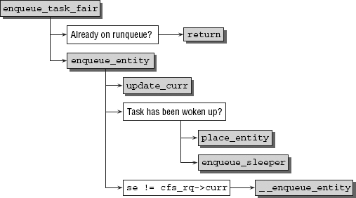
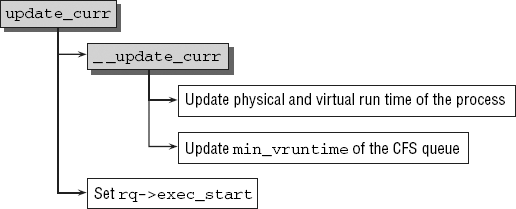

# Scheduler

```c
kernel/sched.h

struct sched_class {
    const struct sched_class *next;

    void (*enqueue_task) (struct rq *rq, struct task_struct *p, int flags);
    void (*dequeue_task) (struct rq *rq, struct task_struct *p, int flags);
    void (*yield_task) (struct rq *rq);
    bool (*yield_to_task) (struct rq *rq, struct task_struct *p, bool preempt);

    void (*check_preempt_curr) (struct rq *rq, struct task_struct *p, int flags);

    /*
     * It is the responsibility of the pick_next_task() method that will
     * return the next task to call put_prev_task() on the @prev task or
     * something equivalent.
     *
     * May return RETRY_TASK when it finds a higher prio class has runnable
     * tasks.
     */
    struct task_struct * (*pick_next_task) (struct rq *rq,
                        struct task_struct *prev,
                        struct rq_flags *rf);
    void (*put_prev_task) (struct rq *rq, struct task_struct *p);

#ifdef CONFIG_SMP
    int  (*select_task_rq)(struct task_struct *p, int task_cpu, int sd_flag, int flags);
    void (*migrate_task_rq)(struct task_struct *p);

    void (*task_woken) (struct rq *this_rq, struct task_struct *task);

    void (*set_cpus_allowed)(struct task_struct *p,
                 const struct cpumask *newmask);

    void (*rq_online)(struct rq *rq);
    void (*rq_offline)(struct rq *rq);
#endif

    void (*set_curr_task) (struct rq *rq);
    void (*task_tick) (struct rq *rq, struct task_struct *p, int queued);
    void (*task_fork) (struct task_struct *p);
    void (*task_dead) (struct task_struct *p);
 /*
     * The switched_from() call is allowed to drop rq->lock, therefore we
     * cannot assume the switched_from/switched_to pair is serliazed by
     * rq->lock. They are however serialized by p->pi_lock.
     */
    void (*switched_from) (struct rq *this_rq, struct task_struct *task);
    void (*switched_to) (struct rq *this_rq, struct task_struct *task);
    void (*prio_changed) (struct rq *this_rq, struct task_struct *task,
                 int oldprio);

    unsigned int (*get_rr_interval) (struct rq *rq,
                     struct task_struct *task);

    void (*update_curr) (struct rq *rq);

#define TASK_SET_GROUP  0
#define TASK_MOVE_GROUP 1

#ifdef CONFIG_FAIR_GROUP_SCHED
    void (*task_change_group) (struct task_struct *p, int type);
#endif
};
```


```c
kernel/sched.h

/*
 * {de,en}queue flags:
 *
 * DEQUEUE_SLEEP  - task is no longer runnable
 * ENQUEUE_WAKEUP - task just became runnable
 *
 * SAVE/RESTORE - an otherwise spurious dequeue/enqueue, done to ensure tasks
 *                are in a known state which allows modification. Such pairs
 *                should preserve as much state as possible.
 *
 * MOVE - paired with SAVE/RESTORE, explicitly does not preserve the location
 *        in the runqueue.
 *
 * ENQUEUE_HEAD      - place at front of runqueue (tail if not specified)
 * ENQUEUE_REPLENISH - CBS (replenish runtime and postpone deadline)
 * ENQUEUE_MIGRATED  - the task was migrated during wakeup
 *
 */
#define DEQUEUE_SLEEP		0x01
#define DEQUEUE_SAVE		0x02 /* Matches ENQUEUE_RESTORE */
#define DEQUEUE_MOVE		0x04 /* Matches ENQUEUE_MOVE */
#define DEQUEUE_NOCLOCK		0x08 /* Matches ENQUEUE_NOCLOCK */

#define ENQUEUE_WAKEUP		0x01
#define ENQUEUE_RESTORE		0x02
#define ENQUEUE_MOVE		0x04
#define ENQUEUE_NOCLOCK		0x08

#define ENQUEUE_HEAD		0x10
#define ENQUEUE_REPLENISH	0x20
#ifdef CONFIG_SMP
#define ENQUEUE_MIGRATED	0x40
#else
#define ENQUEUE_MIGRATED	0x00
#endif
```


#### priorities and weight

The kernel use [0, 139] to represent priorities internally

- lower values mean higher priorities 
- range [0, 99]  is reserved for real-time processes 
- nice values [-20, 19] are mapped to the range from 100 to 139 
- real-time processes thus always have a higher priority than normal processes can ever have 

```c
/*
 * Nice levels are multiplicative, with a gentle 10% change for every
 * nice level changed. I.e. when a CPU-bound task goes from nice 0 to
 * nice 1, it will get ~10% less CPU time than another CPU-bound task
 * that remained on nice 0.
 *
 * The "10% effect" is relative and cumulative: from _any_ nice level,
 * if you go up 1 level, it's -10% CPU usage, if you go down 1 level
 * it's +10% CPU usage. (to achieve that we use a multiplier of 1.25.
 * If a task goes up by ~10% and another task goes down by ~10% then
 * the relative distance between them is ~25%.)
 */
const int sched_prio_to_weight[40] = {
 /* -20 */     88761,     71755,     56483,     46273,     36291,
 /* -15 */     29154,     23254,     18705,     14949,     11916,
 /* -10 */      9548,      7620,      6100,      4904,      3906,
 /*  -5 */      3121,      2501,      1991,      1586,      1277,
 /*   0 */      1024,       820,       655,       526,       423,
 /*   5 */       335,       272,       215,       172,       137,
 /*  10 */       110,        87,        70,        56,        45,
 /*  15 */        36,        29,        23,        18,        15,
};
```


## CFS

### enqueue_task_fair




```c
kernel/sched/fair.c

static void
enqueue_task_fair(struct rq *rq, struct task_struct *p, int flags)
{
    struct cfs_rq *cfs_rq;
    struct sched_entity *se = &p->se;

    /*
     * If in_iowait is set, the code below may not trigger any cpufreq
     * utilization updates, so do it here explicitly with the IOWAIT flag
     * passed.
     */
    if (p->in_iowait)
        cpufreq_update_this_cpu(rq, SCHED_CPUFREQ_IOWAIT);

    for_each_sched_entity(se) {
        if (se->on_rq)
            break;
        cfs_rq = cfs_rq_of(se);
        enqueue_entity(cfs_rq, se, flags);

        /*
         * end evaluation on encountering a throttled cfs_rq
         *
         * note: in the case of encountering a throttled cfs_rq we will
         * post the final h_nr_running increment below.
         */
        if (cfs_rq_throttled(cfs_rq))
            break;
        cfs_rq->h_nr_running++;

        flags = ENQUEUE_WAKEUP;
    }

    for_each_sched_entity(se) {
        cfs_rq = cfs_rq_of(se);
        cfs_rq->h_nr_running++;

        if (cfs_rq_throttled(cfs_rq))
            break;

        update_load_avg(se, UPDATE_TG);
        update_cfs_shares(se);
    }
    
    if (!se)
        add_nr_running(rq, 1);

    hrtick_update(rq);
}
```


```c
kernel/sched/fair.c

/*
 * MIGRATION
 *
 *  dequeue
 *    update_curr()
 *      update_min_vruntime()
 *    vruntime -= min_vruntime
 *
 *  enqueue
 *    update_curr()
 *      update_min_vruntime()
 *    vruntime += min_vruntime
 *
 * this way the vruntime transition between RQs is done when both
 * min_vruntime are up-to-date.
 *
 * WAKEUP (remote)
 *
 *  ->migrate_task_rq_fair() (p->state == TASK_WAKING)
 *    vruntime -= min_vruntime
 *
 *  enqueue
 *    update_curr()
 *      update_min_vruntime()
 *    vruntime += min_vruntime
 *
 * this way we don't have the most up-to-date min_vruntime on the originating
 * CPU and an up-to-date min_vruntime on the destination CPU.
 */

static void
enqueue_entity(struct cfs_rq *cfs_rq, struct sched_entity *se, int flags)
{
    bool renorm = !(flags & ENQUEUE_WAKEUP) || (flags & ENQUEUE_MIGRATED);
    bool curr = cfs_rq->curr == se;

    /*
     * If we're the current task, we must renormalise before calling
     * update_curr().
     */
    if (renorm && curr)
        se->vruntime += cfs_rq->min_vruntime;

    update_curr(cfs_rq);

    /*
     * Otherwise, renormalise after, such that we're placed at the current
     * moment in time, instead of some random moment in the past. Being
     * placed in the past could significantly boost this task to the
     * fairness detriment of existing tasks.
     */
    if (renorm && !curr)
        se->vruntime += cfs_rq->min_vruntime;

    /*
     * When enqueuing a sched_entity, we must:
     *   - Update loads to have both entity and cfs_rq synced with now.
     *   - Add its load to cfs_rq->runnable_avg
     *   - For group_entity, update its weight to reflect the new share of
     *     its group cfs_rq
     *   - Add its new weight to cfs_rq->load.weight
     */
    update_load_avg(se, UPDATE_TG);
    enqueue_entity_load_avg(cfs_rq, se);
    update_cfs_shares(se);
    account_entity_enqueue(cfs_rq, se);

    if (flags & ENQUEUE_WAKEUP) 	   // 进程休眠，vruntime保持不变，而其他进程的vruntime持续增
        place_entity(cfs_rq, se, 0);   // 长，此时进程被唤醒，由于vruntime较小，就会一直获得cpu运
									   // 行时间，容易造成进程饥饿，通过place_entity进行补偿

    check_schedstat_required();
    update_stats_enqueue(cfs_rq, se, flags);
    check_spread(cfs_rq, se);
    if (!curr)
        __enqueue_entity(cfs_rq, se); // Enqueue an entity into the rb-tree
    se->on_rq = 1;

    if (cfs_rq->nr_running == 1) {
        list_add_leaf_cfs_rq(cfs_rq);
        check_enqueue_throttle(cfs_rq);
    }
}

```



```c
kernel/sched/fair.c

/*
 * Update the current task's runtime statistics.
 */
static void update_curr(struct cfs_rq *cfs_rq)
{
    struct sched_entity *curr = cfs_rq->curr;
    u64 now = rq_clock_task(rq_of(cfs_rq));
    u64 delta_exec;

    if (unlikely(!curr))
        return;

    delta_exec = now - curr->exec_start;
    if (unlikely((s64)delta_exec <= 0))
        return;

    curr->exec_start = now;

    schedstat_set(curr->statistics.exec_max,
              max(delta_exec, curr->statistics.exec_max));

    curr->sum_exec_runtime += delta_exec;
    schedstat_add(cfs_rq->exec_clock, delta_exec);

    curr->vruntime += calc_delta_fair(delta_exec, curr);
    update_min_vruntime(cfs_rq);

    if (entity_is_task(curr)) {
        struct task_struct *curtask = task_of(curr);

        trace_sched_stat_runtime(curtask, delta_exec, curr->vruntime);
        cpuacct_charge(curtask, delta_exec);
        account_group_exec_runtime(curtask, delta_exec);
    }

    account_cfs_rq_runtime(cfs_rq, delta_exec);
}
```


## Real-Time Scheduling

```c
kernel/sched.c
struct rt_prio_array {
        DECLARE_BITMAP(bitmap, MAX_RT_PRIO+1); /* include 1 bit for delimiter */
        struct list_head queue[MAX_RT_PRIO];
};

struct rt_rq {
        struct rt_prio_array active;
};
```


## SMP Scheduling


## Kernel Preemption

